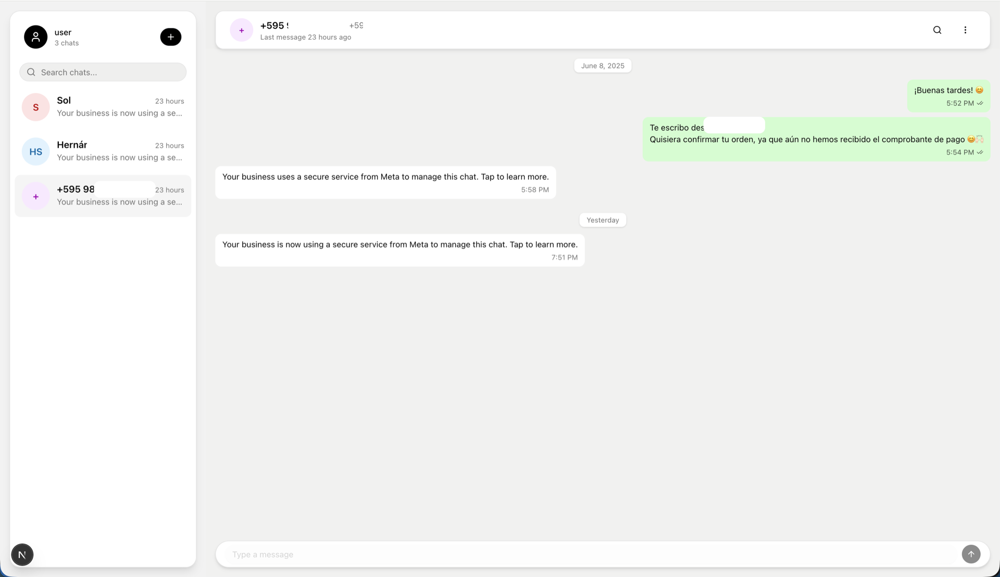
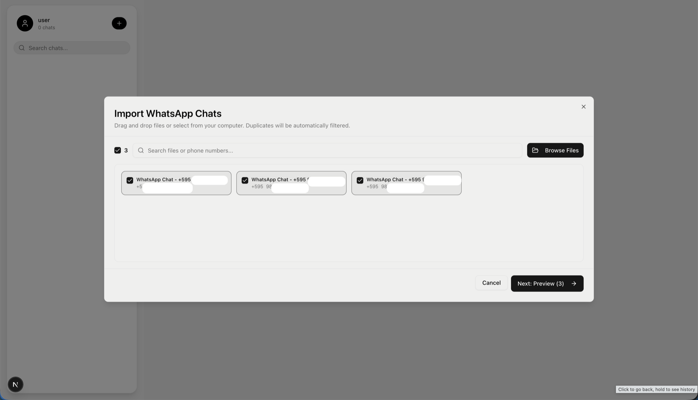

# Wamory - Secure WhatsApp Business Chat History Viewer

> **Wa**tsApp + Me**mory** - Your secure solution for preserving WhatsApp Business conversations

**Built with Next.js 16, React 19, and stored as encrypted JSON** - no SQL database needed because JSON is fast enough for thousands of chats.

## Screenshots

*Chat list with search and navigation*

*Individual chat conversation view*

## The Problem I Faced

I was switching phones and needed to keep my WhatsApp Business chats - years of client conversations that I couldn't afford to lose. Everything I found was either sketchy cloud services with no encryption, or complicated self-hosted solutions that required too much setup. I just wanted something simple and secure that I could trust with my business data. So I spent a weekend building this.

## Quick Start

Fork this repo, deploy to Vercel, and add your `BLOB_READ_WRITE_TOKEN` from the [Vercel Blob Dashboard](https://vercel.com/dashboard/stores) to your environment variables.

## How It Works

### First Visit
1. App generates a random 12-word mnemonic phrase
2. User backs up the phrase (write it down!)
3. App derives encryption key from mnemonic using PBKDF2
4. Key hash stored in Vercel Blob for validation
5. Empty encrypted data blob created

### Return Visits
1. User enters 12-word phrase
2. App derives key and checks hash
3. If valid, encrypted data is downloaded and decrypted in browser
4. User sees their chats

### Importing WhatsApp Chats

1. **Export from WhatsApp:**
   - Open WhatsApp > Chat > More > Export Chat
   - Choose "Without Media" or "Include Media"
   - Save the file (usually named `WhatsApp Chat - +1234567890.txt`)

2. **Import to Wamory:**
   - Click "Import Chats" in the app
   - Select your exported `.txt` or `.zip` files
   - Files are encrypted and stored securely

## Security

Zero-knowledge encryption with AES-256-GCM. Your 12-word mnemonic phrase is never stored - not even as a hash. All encryption happens in your browser before data reaches the server. The server cannot validate your passphrase; it simply attempts decryption - if it works, you're authenticated.

## Contributing

Contributions are welcome! This is a side project, so I appreciate:

- 🐛 Bug reports and fixes
- 💡 Feature suggestions
- 📖 Documentation improvements
- ⭐ Stars (if you find this useful!)

See [CONTRIBUTING.md](CONTRIBUTING.md) for guidelines.

## License

MIT License - see [LICENSE](LICENSE) for details.

---

**⭐ If Wamory helped you preserve your WhatsApp Business history, consider giving it a star!**
